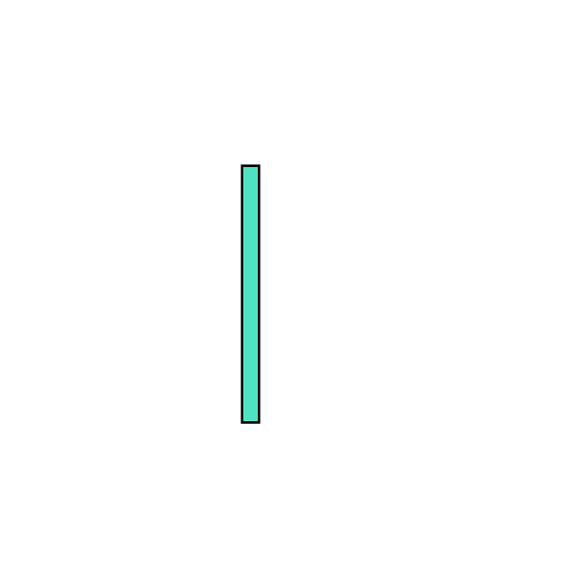

<!-- "The" content BEGIN -->

    
<!-- I'm godly resourceful -->
        
        
        
<!-- I'm godly resourceful -->
    

<!-- "The" content END -->

<!-- Badges  BEGIN -->

    <!-- Social  -->
        
        
    <!-- Count -->
        

<!-- Badges  END -->